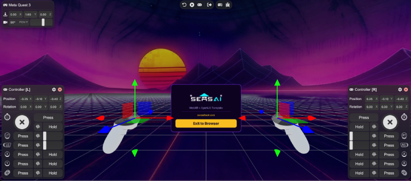
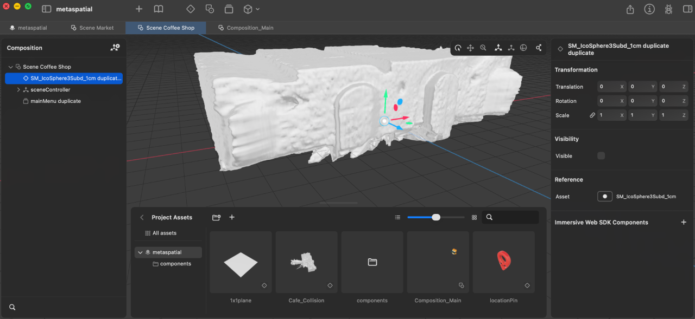

# sensai-webxr-worldmodels

Template project for building WebXR worldmodel experiences with IWSDK, SparkJS Gaussian splats, and spatial UI.


## Getting Started
Prerequisites: Node `>=20.19.0`, a WebXR-capable browser, and an optional headset for immersive testing.

Install and run:

```bash
npm install
npm run dev
```

### How to Add Your Own Splat

1. Attach `GaussianSplatLoader` to an entity (already done in `src/index.ts`).
2. Set `splatUrl` to your local or remote `.spz`/`.ply`.
3. Optionally set `meshUrl` to a `.gltf/.glb` collision mesh.
4. Keep large splat files outside the repo (for example in object storage) and load via URL.

## SensAI Helpers

### Gaussian Splat Loader
- Loads and unloads local or remote `.spz`/`.ply` splats as children of an entity transform.
- Supports optional collider loading through `meshUrl` (`GLTFLoader`) for locomotion hit testing.
- Includes timeout-based loading and explicit error propagation.
- API surface:
  - Component props: `splatUrl`, `meshUrl`, `autoLoad`, `animate`, `enableLod`, `lodSplatScale`
  - System methods: `load(entity, { animate? })`, `unload(entity, { animate? })`, `replayAnimation(entity, { duration? })`
- Typical usage: add `GaussianSplatLoader` to an entity, set URLs, then let `autoLoad` handle startup or call system methods for runtime swaps.

### Gaussian Splat Animator

- GPU-accelerated fly-in/fly-out effect powered by SparkJS `dyno`.
- Animates per-splat position, turbulence, scale, and opacity while CPU updates only a progress uniform.


## Worldmodels
- Uses `.spz` or `.ply` worldmodel assets.
- Position, scale, and pivot are controlled by the hosting entity transform.
- Runtime loading is handled by `GaussianSplatLoader`.

### Marble (WorldLabs)
- World Labs Marble outputs can be exported as Gaussian splats and used as source assets.
- For interaction and locomotion, pair splats with a separate collision mesh.
- If using remote-generated assets, integrate your own fetch/API flow before assigning `splatUrl`.
- Host large splat files outside the repository (object storage/CDN is recommended).

### SparkJS
- Open-source Gaussian splat renderer from the World Labs team: https://sparkjs.dev/
- Provides performant Gaussian splat rendering for WebGL2/WebXR in Three.js-based scenes.
- This project uses **SparkJS 2.0 preview** with Level-of-Detail (LoD) enabled.

***Level of Detail (LoD)***
- LoD automatically adjusts splat quality based on distance: nearby areas render at full detail while distant areas use fewer, coarser splats.
- This keeps frame rate stable on resource-constrained devices (Quest, PICO) by maintaining a fixed rendering budget instead of always rendering every splat.
- LoD is enabled by default on the `GaussianSplatLoader` component (`enableLod: true`). Adjust `lodSplatScale` to trade quality for performance (lower = faster, higher = sharper).
- **Runtime LoD (default):** Point `splatUrl` at any `.spz` file. The LoD tree is computed in-browser on load (~4s for 500K splats). No extra tooling needed.
- **Pre-built LoD (faster startup):** Bake the LoD tree offline so the browser skips the computation. Clone the [SparkJS repo](https://github.com/sparkjsdev/spark/tree/v2.0.0-preview), build the Rust CLI, and run:

```bash
cargo build --manifest-path rust/build-lod/Cargo.toml --release
./rust/target/release/build-lod --spz your-splat.spz
# produces your-splat-lod.spz
```

***Three.js Version & Compatibility***
- This project uses `super-three@0.181.0` (Three.js r181), upgraded from r177 to support SparkJS 2.0.
- IWSDK externalizes its Three.js dependency, so it automatically uses the project's version. A custom Vite plugin (`deduplicateThree` in `vite.config.ts`) redirects IWSDK's bundled r177 imports to the project's single r181 instance, preventing duplicate Three.js modules.
- A camera clone patch in `gaussianSplatLoader.ts` prevents a per-frame crash caused by SparkJS's LoD system deep-cloning IWSDK's non-clonable UI objects.
- **These workarounds are temporary.** IWSDK has already [migrated to r181 on GitHub](https://github.com/facebook/immersive-web-sdk/commit/7317fdb) (Dec 2025) but has not published a new npm release since v0.2.2 (Nov 2025). Once the next IWSDK version ships, the Vite dedup plugin can be removed. The camera clone patch remains needed until SparkJS changes its `driveLod` behavior.


## IWSDK 
IWSDK (Immersive Web SDK) is a WebXR-focused ECS framework for building interactive 3D/XR apps with built-in systems such as locomotion, grabbing, spatial UI, and XR session management.
see https://elixrjs.io/

### Headset simulator

How to use

- The project enables the IWSDK local simulator via `@iwsdk/vite-plugin-iwer` in `vite.config.ts`.
- Run `npm run dev` on localhost, open the app in a desktop browser, and use the injected simulator controls to emulate headset/controller behavior during iteration.

### UI
see https://iwsdk.dev/guides/10-spatial-ui-uikitml.html
The default render order can conflict with splat rendering, so this template applies a render-order/depth configuration to keep IWSDK UI above splats.
Pointer depth behavior is also handled so panel interaction remains reliable.

### Interactions and Locomotion 

- Built-in interactions such as one-/two-hand grab and distance grab:
  https://iwsdk.dev/guides/06-built-in-interactions.html
- Locomotion concepts (teleport, slide/smooth locomotion, turn):
  https://iwsdk.dev/concepts/locomotion/
- This template enables locomotion and grabbing in `World.create(...)`.

### Spatial Editor

- Disabled by default.
- Add it if your workflow requires in-world authoring or frequent scene adjustments during development.

## Testing and Deployment
- Build/deploy basics: https://elixrjs.io/guides/08-build-deploy.html
- Local testing: `npm run dev`
- Preview production build locally: `npm run build && npm run preview`
- ***recommended deployment workflow***: deploy static build output (`dist/`) on Cloudflare.


## Acknowledgements & Credits

Check out our other kits:
- [SensAI Kits](https://github.com/SensAIHackademy/SensAIKits) – context-aware AI templates
- [World Model Kits](https://github.com/SensAIHackademy/SensAIWorldModelKits) – WebXR, Unity, Unreal templates
- [PICO Kits](https://github.com/SensAIHackademy/SensAI-PICO-Kits) – world models + voice command templates

Explore [SensAI Hacks](https://sensaihack.com/) and connect with a community of creators and innovators.
Visit our [Knowledge Hub](https://xrbootcamp.notion.site/SensAI-Knowledge-Hub-21f0095e34d880ec9826d9749ae56619) for curated resources.


Powered by **SensAI Hackademy**
